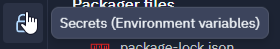
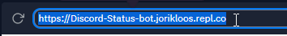

If you want to change your botghost status without buying premium or just want to change the status of bot. You can use this repl.

Step 1: Fork this replit

Step2: Go to secrets. And make a variable called `TOKEN`. Put in your bot token as value.

step3: Start this replit, it will ask for a status. You can type what status you want.

Step4: It will load. Now you discord bot should have a different status

Now the bot is online and it works. If it doesn't, contact me `Raadsel#9398`
If you want to get this program 24/7 online, follow the next steps. 

Sidenote, if you save a new command, restart your bot or change anything on botghost you have to also restart this, for the status to appear

Step5: Go to https://uptimerobot.com and make a account or log in.

Step6: Click on add new monitor. Choose as monitor type http(s). You can name the friendly name something like Discord Status bot or something, it doesn't really matter. 

Step7: Now as URL (or IP) you have to fill in the website url of this replit. Default it is `https://Discord-Status-bot.yourreplname.repl.co`.  Just copy the link and paste it in there

Step8: As monetoring interval you ca choose 5 minutes or longer. You need premium to have a monetoring interval under 5 minutes. Uncheck the Monitor SSL error and Enable SSL expiry reminders. Leave the monetoring timeout as it is. Now click create monetoring.

Congrats, this replit should be online 24/7

If you have any suggestions make sure to type in the the comments!!